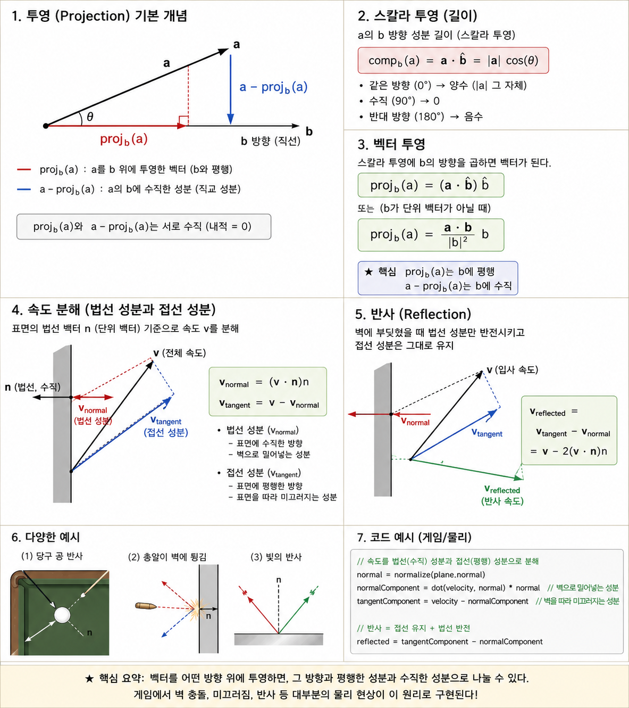

## 소개

게임에서 "적이 내 앞에 있는가?", "이 벽에 빛이 얼마나 닿는가?", "공이 벽에 부딪혔을 때 어느 방향으로 튕길까?" 같은 질문에 답하려면 **두 방향이 얼마나 같은 쪽을 향하는지**를 알아야 한다. 내적(Dot Product)은 정확히 이것을 계산하는 연산이다.

내적의 결과는 **하나의 숫자(스칼라)**다. 벡터가 아니라 그냥 값 하나가 나온다. 이 값의 부호와 크기를 보면 두 벡터의 방향 관계를 즉시 알 수 있다.

- 결과가 **양수** → 두 벡터가 비슷한 방향 (같은 쪽)
- 결과가 **0** → 두 벡터가 수직 (직교)
- 결과가 **음수** → 두 벡터가 반대 방향

---

## 1. 정의

두 벡터 a, b의 내적은 두 가지 관점에서 정의할 수 있다. 둘 다 같은 값을 계산하지만, 이해하는 방식이 다르다.

### 성분별 계산 (대수적)

가장 직접적인 방법이다. 각 좌표 성분끼리 곱해서 모두 더한다.

$$\mathbf{a} \cdot \mathbf{b} = a_x \cdot b_x + a_y \cdot b_y + a_z \cdot b_z$$

예시:
```text
a = (2, 0, 1)
b = (1, 3, 2)

a · b = 2×1 + 0×3 + 1×2 = 2 + 0 + 2 = 4
```

### 크기와 각도로 계산 (기하적)

두 벡터의 길이와 그 사이 각도로도 같은 결과가 나온다.

$$\mathbf{a} \cdot \mathbf{b} = |\mathbf{a}| \times |\mathbf{b}| \times \cos(\theta)$$

여기서 $\theta$는 두 벡터 사이의 각도다. 이 공식이 말하는 것: 두 벡터가 완전히 같은 방향($\theta=0°$)이면 $\cos(\theta)=1$이 돼서 최댓값이 나오고, 수직($\theta=90°$)이면 $\cos(\theta)=0$이 돼서 0, 정반대($\theta=180°$)면 $\cos(\theta)=-1$이 돼서 최솟값이 나온다.

### 두 정의가 왜 같은가? (코사인 제2법칙과의 연결)

두 벡터 $\mathbf{a}$와 $\mathbf{b}$가 이루는 삼각형에서, 맞은편 변 벡터는 $\mathbf{a} - \mathbf{b}$다.

1. **대수적 전개 (성분 계산)**:
   $$\|\mathbf{a} - \mathbf{b}\|^2 = (\mathbf{a} - \mathbf{b}) \cdot (\mathbf{a} - \mathbf{b}) = \|\mathbf{a}\|^2 + \|\mathbf{b}\|^2 - 2(\mathbf{a} \cdot_{\text{alg}} \mathbf{b})$$

2. **기하학의 코사인 제2법칙**:
   $$\|\mathbf{a} - \mathbf{b}\|^2 = \|\mathbf{a}\|^2 + \|\mathbf{b}\|^2 - 2\|\mathbf{a}\|\|\mathbf{b}\|\cos\theta$$

두 식의 우변을 비교하면 $-2$ 뒤의 항이 정확히 일치한다:

$$\mathbf{a} \cdot_{\text{alg}} \mathbf{b} = a_x b_x + a_y b_y + a_z b_z = \|\mathbf{a}\|\|\mathbf{b}\|\cos\theta$$

즉, **좌표 성분끼리 곱해 더한 값**이 곧 **두 벡터의 길이와 사잇각 코사인의 곱**과 수학적으로 완전히 같은 값임이 증명된다.

---

## 2. 내적의 성질

| 성질 | 수식 | 의미 |
|------|------|------|
| 교환법칙 | $\mathbf{a} \cdot \mathbf{b} = \mathbf{b} \cdot \mathbf{a}$ | 순서를 바꿔도 결과 같음 |
| 분배법칙 | $\mathbf{a} \cdot (\mathbf{b} + \mathbf{c}) = \mathbf{a}\cdot\mathbf{b} + \mathbf{a}\cdot\mathbf{c}$ | 합친 후 내적 = 각각 내적 후 합산 |
| 스칼라 곱 | $(s\cdot\mathbf{a}) \cdot \mathbf{b} = s \times (\mathbf{a} \cdot \mathbf{b})$ | 벡터를 늘리면 결과도 그 배율만큼 변함 |
| 자기 자신 | $\mathbf{a} \cdot \mathbf{a} = \|\mathbf{a}\|^2$ | 자기 자신과의 내적 = 길이의 제곱 |
| 수직 판별 | $\mathbf{a} \cdot \mathbf{b} = 0 \iff \mathbf{a} \perp \mathbf{b}$ | 내적이 0이면 두 벡터는 수직 |

자기 자신과의 내적이 $\|\mathbf{a}\|^2$가 된다는 성질은 게임에서 매우 자주 쓰인다.

왜 그런지 보자. 내적의 성분별 계산은 "각 좌표끼리 곱해서 더하는 것"이다. 그런데 a와 a를 내적하면:

$$\mathbf{a} \cdot \mathbf{a} = a_x \times a_x + a_y \times a_y + a_z \times a_z = a_x^2 + a_y^2 + a_z^2$$

그리고 벡터 a의 길이를 구하는 공식은:

$$|\mathbf{a}| = \sqrt{a_x^2 + a_y^2 + a_z^2}$$

즉, $\mathbf{a} \cdot \mathbf{a}$는 $|\mathbf{a}|$를 구하기 위해 sqrt 안에 들어가는 그 값 그 자체다. sqrt만 씌우지 않은 상태 = 길이의 제곱이다:

$$\mathbf{a} \cdot \mathbf{a} = |\mathbf{a}|^2$$

이게 왜 유용한가? 거리를 비교할 때 sqrt를 생략할 수 있기 때문이다. 두 점 사이의 거리가 반지름보다 작은지 검사한다고 하자:

```text
// 원래 방식: sqrt 계산 필요
distance = sqrt(dx² + dy² + dz²)
if distance < radius: ...

// 내적 활용: sqrt 없이 비교
diff = a - b
if dot(diff, diff) < radius × radius: ...
```

두 번째 방식은 sqrt를 한 번도 계산하지 않는다. 대신 비교하는 쪽(radius)을 제곱해주면 결과는 같다. sqrt는 CPU에서 상대적으로 느린 연산이고, 게임 루프에서 매 프레임 수백~수천 번의 거리 비교가 일어나므로 이 차이가 실제 성능에 큰 영향을 준다.

---

## 3. 두 벡터 사이의 각도 구하기

정규화된(길이 1) 두 벡터의 내적은 $\cos(\theta)$다. 역코사인을 취하면 각도가 나온다.

$$\cos(\theta) = \hat{\mathbf{a}} \cdot \hat{\mathbf{b}}$$

$$\theta = \arccos(\text{clamp}(\hat{\mathbf{a}} \cdot \hat{\mathbf{b}},\ -1,\ 1))$$

> **부동소수점 주의**: 부동소수점 오차로 내적 결과가 $[-1, 1]$ 범위를 아주 약간 벗어날 수 있으므로(예: $1.0000001$) $[-1, 1]$로 clamp한다. 그렇지 않으면 $\arccos$가 NaN을 반환한다. 《벡터 보간》 §2(Slerp)도 같은 이유로 clamp를 사용한다.

이걸 게임에서 어떻게 쓰는가?

**적이 플레이어의 시야 안에 있는지 확인:**

플레이어가 바라보는 방향(forward)과 플레이어에서 적까지의 방향(toEnemy)을 내적한다. 시야각(FOV)의 절반이 45°라면, $\cos(45°) \approx 0.707$이다. 내적 결과가 0.707보다 크면 적은 시야 안에 있다.

```text
forward = normalize(player.forward)
toEnemy = normalize(enemy.position - player.position)
cosAngle = dot(forward, toEnemy)

if cosAngle > cos(halfFOV):
    // 적이 시야 안에 있음 → 감지
```

조준 보조, 스킬 사거리 표시, 스텔스 게임의 시야 콘 등에 같은 방식이 쓰인다.

---

## 4. 투영 (Projection)



벡터 a를 벡터 b 위에 투영(projection)이란, **a에서 b가 놓인 직선에 수선을 내려 그 수선의 발을 찾는 연산**이다. 결과 벡터는 b와 평행하다 — 정확히는 b가 놓인 직선 위에 있는 공선형(collinear) 벡터로, 방향은 스칼라 투영의 부호에 따라 b와 같거나 b의 반대이며 길이만 다르다. 직교 성분 $a - \text{proj}_b(a)$는 b에 수직이다.

이 결과의 길이는 $|\text{스칼라 투영}|$이다. 스칼라 투영 $\text{comp}_{\mathbf{b}}(\mathbf{a}) = \mathbf{a} \cdot \hat{\mathbf{b}}$ 자체는 부호 있는 값으로, 반대 방향이면 음수다(아래 스칼라 투영 절 참고). 여기에 방향을 포함한 것이 벡터 투영(vector projection)이다.

### 스칼라 투영

벡터 a의 b 방향 성분 길이는 내적의 기하적 정의에서 바로 나온다:

$$\text{comp}_{\mathbf{b}}(\mathbf{a}) = \mathbf{a} \cdot \hat{\mathbf{b}} = |\mathbf{a}| \cos(\theta)$$

이 값이 의미하는 것:
- a와 b가 같은 방향이면 양수 (|a| 그 자체)
- 수직이면 0
- 반대 방향이면 음수

이게 스칼라 투영이다.

### 벡터 투영

스칼라 투영에 b의 방향을 곱하면 벡터가 된다:

$$\text{proj}_{\mathbf{b}}(\mathbf{a}) = (\mathbf{a} \cdot \hat{\mathbf{b}}) \times \hat{\mathbf{b}}$$

> **핵심**
> proj_b(a)는 b와 공선형(같은 직선 위, 방향은 스칼라 투영 부호에 따라 같거나 반대)이고, **a - proj_b(a)는 b에 수직**이다. 이 두 벡터의 내적은 0이다.

b가 단위 벡터가 아니라면 정규화해서 쓰거나 동등한 형태를 쓸 수 있다:

$$\text{proj}_{\mathbf{b}}(\mathbf{a}) = \frac{\mathbf{a} \cdot \mathbf{b}}{|\mathbf{b}|^2} \times \mathbf{b}$$

두 식은 같다. 분모의 $|\mathbf{b}|^2$가 정규화를 대신한다.

### 속도 분해

게임에서 가장 많이 쓰이는 패턴이다. 속도를 **법선(수직) 성분**과 **접선(평행) 성분**으로 쪼갠다:

- **법선 성분**: 표면에 수직한 방향 → 벽으로 밀어넣는 힘
- **접선 성분**: 표면에 평행한 방향 → 표면을 따라 미끄러지는 힘

$$v_{\text{normal}} = (v \cdot \hat{n}) \hat{n}$$

$$v_{\text{tangent}} = v - v_{\text{normal}}$$

속도를 n에 투영하면 법선 성분이 나오고, 전체에서 빼면 접선 성분이 된다.

```text
// 속도를 법선(수직) 성분과 접선(평행) 성분으로 분해
normal = normalize(plane.normal)
normalComponent = dot(velocity, normal) × normal    // 벽으로 밀어넣는 성분
tangentComponent = velocity - normalComponent        // 벽을 따라 미끄러지는 성분

// 반사 = 접선 유지 + 법선 반전
reflected = tangentComponent - normalComponent
```

벽에 부딪혔을 때 법선 성분만 반전시키고 접선은 그대로 유지하면 반사가 된다. 당구, 핀볼, 벽에 튕기는 총알, 셰이더의 빛 반사까지 전부 이 원리다.

---

## 5. 반사 벡터 (Reflection)

물체가 표면에 부딪혔을 때 튕겨나가는 방향을 계산한다. 당구공, 벽에 튕기는 총알, 셰이더 빛 반사(Specular)의 기본이다.

```text
               n (법선)
               ↑
        \      |      /
      v  \     |     /  r (반사 벡터)
          \    |    /
           ↘   |   ↗
  ═════════════╩═════════════ (벽/표면)
               |
               ↓
          v_n = (v·n)n (벽 안쪽으로 파고드는 성분)
```

### 공식

$$\mathbf{r} = \mathbf{v} - 2(\mathbf{v} \cdot \mathbf{n})\mathbf{n}$$

- $\mathbf{n}$: 표면의 단위 법선 (벽 바깥쪽을 향함)
- $\mathbf{v}$: 입사 벡터 (벽을 향해 들어가는 속도)

### 왜 이 공식이 작동하는가? (직관)
1. 속도 $\mathbf{v}$를 표면에 나란한 **접선 성분($\mathbf{v}_t$)**과 표면에 수직인 **법선 성분($\mathbf{v}_n$)**으로 쪼갠다:
   $$\mathbf{v} = \mathbf{v}_t + \mathbf{v}_n, \qquad \mathbf{v}_n = (\mathbf{v} \cdot \mathbf{n})\mathbf{n}$$
2. 벽에 부딪히면 접선 성분은 유지되고, **법선 성분만 반대로 뒤집혀야(-)** 튕겨나간다:
   $$\mathbf{r} = \mathbf{v}_t - \mathbf{v}_n = (\mathbf{v} - \mathbf{v}_n) - \mathbf{v}_n = \mathbf{v} - 2\mathbf{v}_n = \mathbf{v} - 2(\mathbf{v} \cdot \mathbf{n})\mathbf{n}$$
3. $\mathbf{v}$가 벽을 향해 들어가면 $\mathbf{v} \cdot \mathbf{n} < 0$ (음수)이므로, $-2(\text{음수})\mathbf{n} = +2|\mathbf{v}\cdot\mathbf{n}|\mathbf{n}$이 되어 벽 바깥쪽으로 힘차게 튕겨나온다.

```text
// 벽에 부딪힌 공의 반사
vec3 n = normalize(wall.normal);
vec3 v = ball.velocity;
vec3 reflected = v - 2.0f * dot(v, n) * n;
ball.velocity = reflected;
```

게임에서 활용: 당구공, 핀볼, 벽에 튕기는 총알, 셰이더 반사광, 음파 반사 등.

---

## 6. 방향 판별

내적의 **부호만 봐도** 두 벡터의 대략적인 방향 관계를 알 수 있다. 각도를 정확히 계산할 필요가 없을 때 매우 유용하다.

| $\mathbf{a} \cdot \mathbf{b}$ | 의미 | 각도 |
|-------|------|------|
| $> 0$ | 같은 방향 | $\theta < 90°$ |
| $= 0$ | 수직 | $\theta = 90°$ |
| $< 0$ | 반대 방향 | $\theta > 90°$ |

### 백스테이빙 판정

적의 정면 방향(enemyForward)과 "적에서 플레이어까지의 방향"을 내적한다. 결과가 음수면 플레이어가 적의 뒤에 있다는 뜻이다.

```text
enemyForward = normalize(enemy.forward)
toPlayerFromEnemy = normalize(player.position - enemy.position)
dotResult = dot(enemyForward, toPlayerFromEnemy)

if dotResult < -0.7:
    // 플레이어가 적의 뒤에 있음 → 백스테이빙 가능!
```

이 기법은 스텔스 게임(적 뒤로 다가가기), 전투 게임(뒤잡기), 그리고 "캐릭터가 이 오브젝트를 바라보고 있는가?"를 검사하는 모든 상황에 쓰인다.

---

## 7. 실전 예시: 람버트 조명 (Lambertian)

3D 그래픽스에서 가장 기본적인 조명 모델이다. 표면의 법선과 빛 방향의 내적으로 빛의 세기를 계산한다.

개념은 간단하다: 빛이 표면에 정면(수직)으로 닿으면 가장 밝고, 비스듬히 닿으면 어렴풋이 비추고, 뒤에서 오면 안 보인다. 이게 내적이다.

```text
// 표면의 법선 N과 빛을 향하는 방향 L
N = normalize(normal)                    // 표면이 향하는 방향
L = normalize(lightPos - surfacePos)     // 표면에서 빛을 향하는 방향

intensity = max(0, dot(N, L))   // 음수 방지 (빛이 뒤에서 오면 0)
finalColor = lightColor × surfaceColor × intensity
```

$\text{dot}(\mathbf{N}, \mathbf{L})$이 1이면 빛이 표면에 정면으로 닿는 것(최대 밝기). 0에 가까워질수록 비스듬해져서 어두워진다. 음수면 빛이 표면 뒤에서 오는 것이므로 $\max(0, ...)$로 잘라준다.

이 모델은 모든 3D 게임의 조명 기반이다. 더 복잡한 조명 모델(Blinn-Phong, PBR)도 내적을 기반으로 확장된 것이다.

---

## 8. 빠른 참조

| 연산 | 수식 | 게임 활용 |
|------|------|----------|
| 내적 | $\mathbf{a} \cdot \mathbf{b} = \sum(a_i \times b_i)$ | 기본 연산 |
| 각도 | $\theta = \arccos(\text{clamp}(\hat{\mathbf{a}} \cdot \hat{\mathbf{b}}, -1, 1))$ | 시야 판별, 조준 |
| 투영 | $(\mathbf{a} \cdot \hat{\mathbf{b}})\,\hat{\mathbf{b}}$ | 속도 분해, 그림자 |
| 반사 | $\mathbf{v} - 2(\mathbf{v} \cdot \mathbf{n})\mathbf{n}$ | 튕기기, 반사광 |
| 거리² | $(\mathbf{a}-\mathbf{b}) \cdot (\mathbf{a}-\mathbf{b})$ | 충돌 최적화 |
| 전방 판별 | $\mathbf{a} \cdot \mathbf{b} > 0$ | 방향 체크 |
| 수직 판별 | $\mathbf{a} \cdot \mathbf{b} = 0$ | 직교 확인 |
